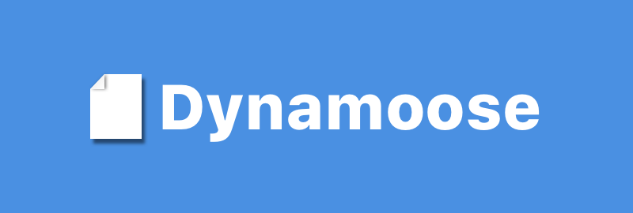

# Remix Recipes

A full-stack web application that provides users with an all-in-one chef experience where users can add recipes, create a meal plan, and generate a shopping list for your meals.

This project builds upon the [Remix Bootcamp: Zero to Mastery](https://zerotomastery.io/courses/learn-remix-run/) course, extending its scope. It utilizes the Architect framework for deployment on AWS Lambda and DynamoDB.

### [live demo](https://remix-recipes.sean-j.dev/)

## Getting Started

1. Make sure your AWS access key pair has been configured.
2. Adding required environment variables

   ```
   AUTH_COOKIE_SECRET=YOUR-COOKIE-SECRET

   MAGIC_LINK_SECRET=YOUR-MAGIC-LINK-SECRET

   ORIGIN=http://localhost:3000

   BREVO_API_KEY=YOUR-BREVO-API-KEY

   AWS_REGION=YOUR-AWS-REGION

   S3_STATIC_BUCKET=YOUR-S3-BUCKET
   ```

3. From your terminal:

   ```sh
   npm install
   ```

4. Please note the data will be seeding to AWS DynamoDB after dev server started

### Available scripts

| Script         | Description                                          |
| -------------- | ---------------------------------------------------- |
| npm run dev    | Start the development server (http://localhost:3000) |
| npm build      | Build the production-ready code                      |
| npm run deploy | Deploy production build to AWS                       |

## This project utilizes the following technologies:

<div >
  <a href="https://remix.run" target="_blank" rel="noreferrer">
    
  </a>
  <a href="https://tailwindcss.com" target="_blank" rel="noreferrer">
    
  </a>
  <a href="https://zod.dev" target="_blank" rel="noreferrer">
    
  </a>
  <a href="https://aws.amazon.com/dynamodb" target="_blank" rel="noreferrer">
    
  </a>
  <a href="https://dynamoosejs.com" target="_blank" rel="noreferrer">
    
  </a>
  <a href="https://playwright.dev" target="_blank" rel="noreferrer">
    
  </a>
  <a href="https://aws.amazon.com/lambda" target="_blank" rel="noreferrer">
    
  </a>
  <a href="https://www.typescriptlang.org" target="_blank" rel="noreferrer">
    
  </a>
  <a
    href="https://github.com/features/actions"
    target="_blank"
    rel="noreferrer"
  >
    
  </a>
</div>

## Thanks to:

- [ZTM](https://zerotomastery.io): Thanks to these outstanding courses, I gained valuable knowledge throughout the journey.
- Service and platform providers.
- All individuals who have contributed packages utilized by this project.
